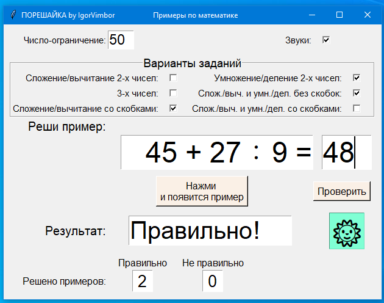
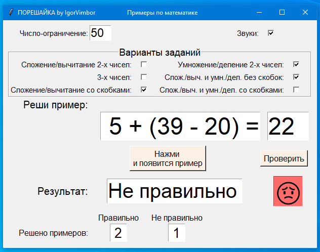

## Порешайка

<div align="center" markdown="1">


</div>

### Симулятор по математике для начальной школы

---

## 📋 `О проекте`

**ПОРЕШАЙКА** - программа-симулятор для решения заданий по математике начальной школы.

### ✅ Возможности программы

Позволяет решать задания на различные математические операции с 2 или 3 числами::
- сложение и вычитание без скобок и со скобками,
- умножение в пределах таблицы умножения,
- деление чисел,
- сложение и вычитание с умножением и делением без скобок и со скобками.

### ✅ Особенности программы

- Задания генерируются случайным образом в пределах числа-ограничения (числа в заданиях не будут превышать установленного пользователем лимита).
- Результат вычисления для всех сгенерированных заданий не превышает 100.

---

## 📊 `Скриншоты`

<div align="center" markdown="1">

|  |  |
|----------------------------------------------|------------------------------------------------|
| *Рис. 1 — Правильное решение | *Рис. 2 — Не правильное решение |

</div>

---

## 📊 `Автор`

- **Идея и реализация** — [Vasilenok Igor](https://github.com/IgorVimbor)
- **Период** — ноябрь 2024

---

### `Лицензия`

Проект распространяется под лицензией **MIT**.

---

## 📊 `Запуск программы`

**[⬇️ Скачать Порешайка.exe](https://github.com/IgorVimbor/repo/releases/latest)**

> Для Windows. Установка не требуется — просто запустите файл.


### ✅ Запуск из исходников

```bash
# Клонировать репозиторий
git clone https://github.com/IgorVimbor/poreshaika.git
cd poreshaika

# Для запуска из исходников установка сторонних библиотек не требуется

# Запустить
python app/poreshaika_main.py
```

### ✅ Сборка файла .exe самостоятельно

```bash
# Установка библиотеки
pip install pyinstaller

# Команда для сборки исполняемого файла
pyinstaller --onefile --windowed --add-data "sound_good.wav;." --add-data "sound_bad.wav;." poreshaika_main.py
# Готовый файл poreshaika_main.exe будет в папке dist/
```
- Исполняемый файл poreshaika_main.exe можно переместить в любую удобную папку на локальных дисках.
- После перемещения файла poreshaika_main.exe пустую папку dist/ и папку

### ✅ Особенности использования


---